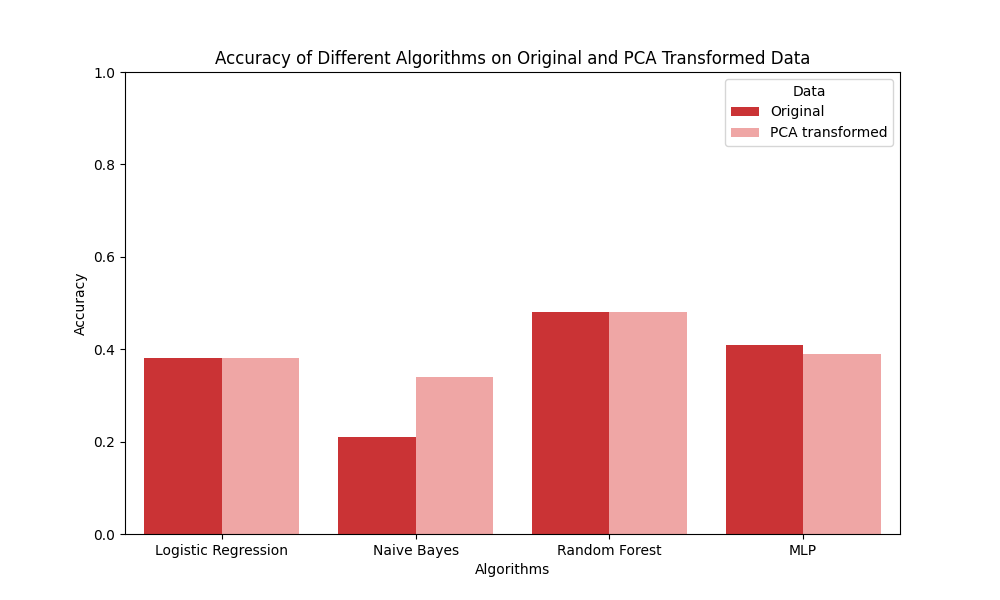

# Mini-Project for Fundamentals of Machine Learning Course

This repository contains the code and data for a mini-project on facial expression recognition using machine learning algorithms.

## 📑 Project Policy
- Team: group should consist of 3-4 students.

    |No.| Student Name    | Student ID |
    | --------| -------- | ------- |
    |1|Nguyễn Vũ Tường Nhân|21110351|
    |2|Trịnh Hoàng Phú|21110370|
    |3|Lê Thanh Tiến|21110409|
    |4|Lê Đăng Nhật|21110354|

- The submission deadline is strict: **11:59 PM** on **June 22nd, 2024**. Commits pushed after this deadline will not be considered.

## 📊 Result



| Algorithms | Data | Macro Avg. Precision | Weighted Avg. Precision | Macro Avg. Recall | Weighted Avg. Recall | Macro Avg. F1-score | Weighted Avg. F1-score | Accuracy |
|---|---|---|---|---|---|---|---|---|
| Logistic Regression | Original | 0.32 | 0.35 | 0.31 | 0.38 | 0.30 | 0.36 | 0.38 |
| Logistic Regression | PCA-transformed | 0.31 | 0.34 | 0.29 | 0.38 | 0.28 | 0.34 | 0.38 |
| Naive Bayes | Original | 0.22 | 0.27 | 0.22 | 0.21 | 0.17 | 0.19 | 0.21 |
| Naive Bayes | PCA-transformed | 0.31 | 0.33 | 0.27 | 0.34 | 0.25 | 0.29 | 0.34 |
| Random Forest | Original | 0.56 | 0.49 | 0.42 | 0.48 | 0.44 | 0.46 | 0.48 |
| Random Forest | PCA-transformed | 0.56 | 0.49 | 0.42 | 0.48 | 0.44 | 0.46 | 0.48 |
| MLP | Original | 0.38 | 0.41 | 0.38 | 0.41 | 0.38 | 0.41 | 0.41 |
| MLP | PCA-transformed | 0.36 | 0.39 | 0.37 | 0.39 | 0.36 | 0.39 | 0.39 |

## 📑 General Observations on PCA's Impact on Model Performance

From the results of the models trained on the Original data and PCA-transformed data, we can make the following general observations about the effect of PCA on model performance:

- **Logistic Regression:** Dimensionality reduction using PCA does not significantly change the overall performance of the model, while helping to reduce model training time. However, it can reduce the model's performance for certain classes.
- **Naive Bayes:** The model trained with PCA data shows improved accuracy, precision, recall, and F1-score, indicating better performance after dimensionality reduction.
- **Random Forest:** The model's performance does not change when using PCA. This indicates that the principal components have retained sufficient information for the model to perform equivalently to using the original data. This typically occurs when the original data has many redundant dimensions, and PCA can remove less informative dimensions without affecting the model's performance.
- **MLP:** The model trained on the original data performs slightly better than the model trained on PCA data. The performance difference between the two models is insignificant. Dimensionality reduction using PCA does not significantly reduce the model's performance; however, in this case, it helps reduce model training time.

## 📝 Classification Performance

Based on models' results with PCA-transformed data, we obtain:

**Model Performance Analysis**

* **Random Forest:** Clearly emerges as the best-performing model based on all metrics except for macro-averaged precision. Its accuracy (0.48) is notably higher than other models. It also strikes a good balance between precision and recall, as evidenced by its F1-scores.

* **MLP:** Performs reasonably well, particularly on the macro-averaged metrics. This suggests it's less biased towards the majority class compared to other models.

* **Logistic Regression and Naive Bayes:** Both models struggle with the task, exhibiting lower accuracy and generally weaker performance across other metrics.

**Emotion Category Performance**

Let's focus on the Random Forest model (the best performer) and analyze its strengths and weaknesses per emotion category:

* **Most Accurate:**
Category 3 (Happiness): The model achieves the highest recall (0.79) and F1-score (0.60), indicating it's very good at correctly identifying instances of happiness and not missing many true positive cases.
* **Most Errors:**
Category 0 (Angry) and Category 2 (Fear): The model exhibits the lowest precision and recall values for these emotions. This means it struggles to distinguish these emotions from others and often misclassifies them.

**Why Random Forest Performs Best**

Random Forest models are inherently good at handling complex classification tasks due to several reasons:

* **Ensemble Learning:** They combine the predictions of multiple decision trees, reducing overfitting and improving generalization.
* **Feature Importance:** They can identify the most important features for classification, potentially revealing insights about the data.
* **Robustness to Noise:** They are less sensitive to outliers and noisy data compared to some other algorithms.

## 📦 Project Structure

The repository is organized into the following directories:

- **/data**: This directory contains the facial expression dataset. You'll need to download the dataset and place it here before running the notebooks. (Download link provided below)
- **/notebooks**: This directory contains the Jupyter notebook ```EDA.ipynb```. This notebook guides you through exploratory data analysis (EDA) and classification tasks.

## ⚙️ Usage

This project is designed to be completed in the following steps:

1. **Fork the Project**: Click on the ```Fork``` button on the top right corner of this repository, this will create a copy of the repository in your own GitHub account. Complete the table at the top by entering your team member names.

2. **Download the Dataset**: Download the facial expression dataset from the following [link](https://mega.nz/file/foM2wDaa#GPGyspdUB2WV-fATL-ZvYj3i4FqgbVKyct413gxg3rE) and place it in the **/data** directory:

3. **Complete the Tasks**: Open the ```notebooks/EDA.ipynb``` notebook in your Jupyter Notebook environment. The notebook is designed to guide you through various tasks, including:
    
    1. Prerequisite
    2. Principle Component Analysis
    3. Image Classification
    4. Evaluating Classification Performance 

    Make sure to run all the code cells in the ```EDA.ipynb``` notebook and ensure they produce output before committing and pushing your changes.

5. **Commit and Push Your Changes**: Once you've completed the tasks outlined in the notebook, commit your changes to your local repository and push them to your forked repository on GitHub.


Feel free to modify and extend the notebook to explore further aspects of the data and experiment with different algorithms. Good luck.
